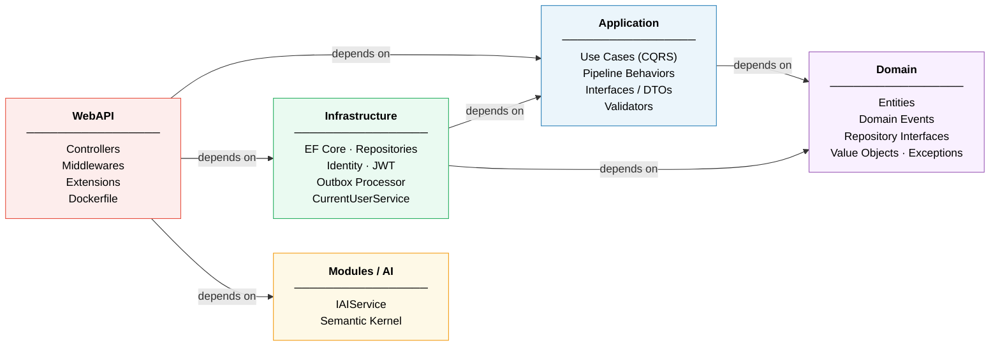
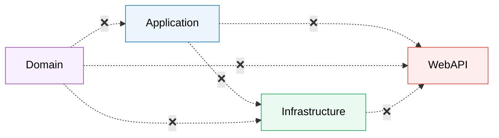
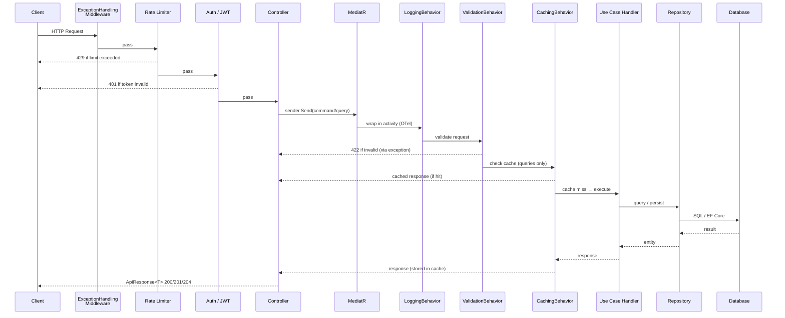
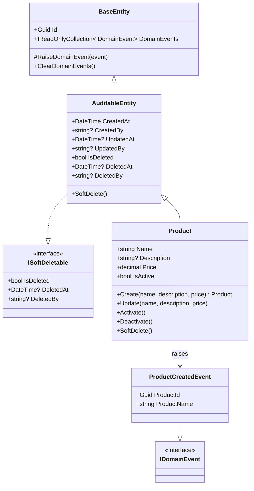
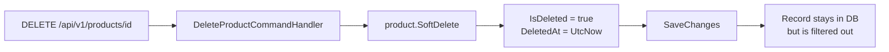
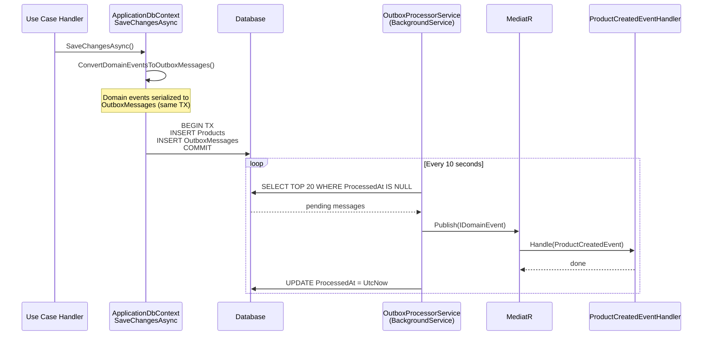
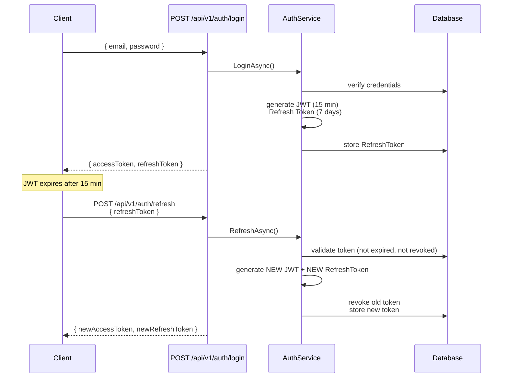
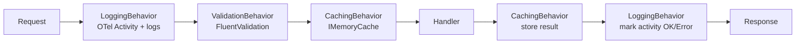
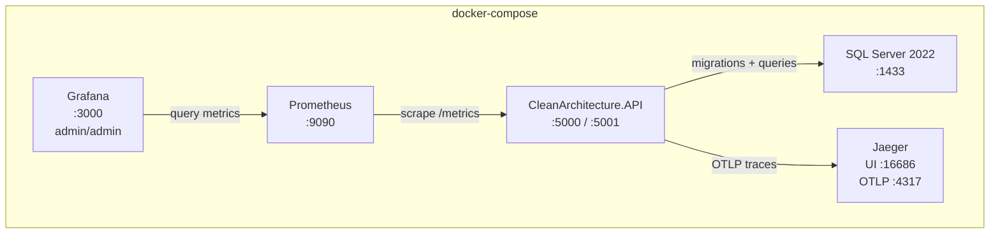
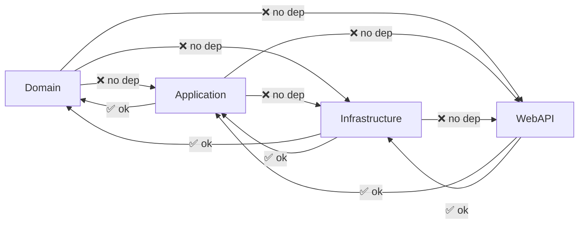

# CleanArchitecture

A production-ready .NET 10 Clean Architecture solution template with CQRS, Domain Events, Outbox Pattern, Soft Delete, JWT + Refresh Tokens, Caching, Rate Limiting, OpenTelemetry, Prometheus/Grafana, API Versioning, Semantic Kernel AI, and automated Architecture Tests.

## Table of Contents

- [Architecture Overview](#architecture-overview)
- [Project Structure](#project-structure)
- [Tech Stack](#tech-stack)
- [Request Flow](#request-flow)
- [Domain Model](#domain-model)
- [Outbox Pattern](#outbox-pattern)
- [Authentication Flow](#authentication-flow)
- [Infrastructure (Docker)](#infrastructure-docker)
- [Getting Started](#getting-started)
- [Configuration Reference](#configuration-reference)
- [Adding a New Use Case](#adding-a-new-use-case)
- [Architecture Rules](#architecture-rules)
- [Key Design Decisions](#key-design-decisions)

---

## Architecture Overview

The solution follows Clean Architecture: **dependency arrows always point inward**. The Domain has zero external dependencies; outer layers depend on inner layers, never the reverse.



**What is forbidden** (enforced by ArchitectureTests):



---

## Project Structure

```
src/
├── Domain/
│   ├── Common/           # BaseEntity, AuditableEntity, ISoftDeletable, ValueObject, IDomainEvent
│   ├── Entities/         # Product (and other domain entities)
│   ├── Events/           # ProductCreatedEvent (and others)
│   ├── Exceptions/       # DomainException, NotFoundException
│   └── Interfaces/       # IRepository<T>, IProductRepository, IUnitOfWork
│
├── Application/
│   ├── Behaviors/        # LoggingBehavior, ValidationBehavior, CachingBehavior
│   ├── Common/           # PagedResult<T>, ICacheableQuery
│   ├── DTOs/             # ProductDto, AuthTokensDto
│   ├── Interfaces/       # IApplicationDbContext, IAuthService, ICurrentUserService, ISqlConnectionFactory
│   ├── Telemetry/        # ApplicationActivitySource (BCL only, no OTel package dep)
│   ├── UseCases/
│   │   └── Products/
│   │       ├── Commands/ # CreateProduct, UpdateProduct, DeleteProduct
│   │       ├── Events/   # ProductCreatedEventHandler
│   │       ├── Queries/  # GetAllProducts, GetProductById, GetProductsSummary
│   │       └── ProductMappings.cs
│   └── Validators/       # CreateProductCommandValidator, UpdateProductCommandValidator
│
├── Infrastructure/
│   ├── Identity/         # ApplicationUser, AuthService, TokenService, JwtSettings, RefreshToken
│   ├── Persistence/
│   │   ├── Configurations/  # EF Fluent API configurations
│   │   ├── Migrations/      # EF Core migrations
│   │   ├── Outbox/          # OutboxMessage, OutboxProcessorService
│   │   └── Repositories/    # BaseRepository<T>, ProductRepository, ProductQueries (Dapper)
│   └── Services/         # CurrentUserService
│
├── WebAPI/
│   ├── Controllers/      # ProductsController, AuthController, AIController
│   ├── Extensions/       # Observability, HealthChecks, Cors, RateLimiting
│   ├── Middlewares/      # ExceptionHandlingMiddleware (Problem Details RFC 9457)
│   └── Models/           # ApiResponse<T>
│
└── Modules/
    └── AI/               # IAIService, SemanticKernelService, NoOpAIService

tests/
├── UnitTests/            # Domain + Application logic (NSubstitute + FluentAssertions)
├── IntegrationTests/     # API endpoints (WebApplicationFactory + InMemory DB)
└── ArchitectureTests/    # Dependency rules (NetArchTest)

docker/
├── prometheus/           # prometheus.yml scrape config
└── grafana/provisioning/ # Datasource + dashboard provisioning
```

---

## Tech Stack

| Concern | Library | Version |
|---|---|---|
| Framework | .NET | 10 |
| CQRS / Mediator | MediatR | 12 |
| Validation | FluentValidation | 11 |
| Object Mapping | Manual extension methods | — |
| ORM (write side) | Entity Framework Core | 10 |
| Read-side queries | Dapper | 2 |
| Authentication | ASP.NET Core Identity + JWT Bearer | 10 |
| AI Integration | Microsoft Semantic Kernel | 1.73 |
| Logging | Serilog | 9 |
| Tracing | OpenTelemetry → Jaeger (OTLP) | 1.12 |
| Metrics | OpenTelemetry → Prometheus + Grafana | 1.12 |
| Health Checks | ASP.NET Core + EF Core | 10 |
| Rate Limiting | ASP.NET Core (Fixed Window) | 10 |
| CORS | ASP.NET Core | 10 |
| Resilience | Microsoft.Extensions.Http.Resilience (Polly) | 9 |
| API Versioning | Asp.Versioning.Mvc | 8 |
| API Docs | Scalar + OpenAPI | 2 |
| Unit Tests | xUnit + NSubstitute + FluentAssertions | — |
| Architecture Tests | NetArchTest | — |
| Containerization | Docker + docker-compose | — |

---

## Request Flow

Every HTTP request goes through a consistent pipeline before reaching the handler.



### Response Envelope

All successful responses use `ApiResponse<T>`:

```json
{
  "data": { ... },
  "message": null
}
```

All error responses use **Problem Details (RFC 9457)**:

```json
{
  "type": "https://tools.ietf.org/html/rfc9110#section-15.5.1",
  "title": "Not Found",
  "status": 404,
  "instance": "/api/v1/products/00000000-0000-0000-0000-000000000000",
  "traceId": "4bf92f3577b34da6a3ce929d0e0e4736"
}
```

---

## Domain Model



### Soft Delete

`Product.SoftDelete()` marks the record as deleted without removing it from the database. A global EF Core query filter (`!IsDeleted`) is applied automatically to all `ISoftDeletable` entities, so soft-deleted records are **invisible** to all queries by default.



---

## Outbox Pattern

Domain events are not dispatched synchronously. Instead they are persisted to an `OutboxMessages` table **in the same transaction** as the entity change. A background service polls and dispatches them via MediatR.



**Benefits:** event delivery survives process restarts; no risk of events being lost if dispatch fails after the entity is saved.

---

## Authentication Flow



Refresh token rotation: every `/auth/refresh` call revokes the old token and issues a new pair. Reuse of a revoked token is detectable via the `ReplacedByToken` chain.

---

## Pipeline Behaviors

MediatR behaviors are executed in the following order for every request:



**Caching opt-in:** implement `ICacheableQuery` on any `IRequest<TResponse>`:

```csharp
public sealed record GetProductByIdQuery(Guid Id)
    : IRequest<ProductDto?>, ICacheableQuery
{
    public string CacheKey => $"product:{Id}";
    public TimeSpan? AbsoluteExpiration => TimeSpan.FromMinutes(10);
}
```

---

## Infrastructure (Docker)



| Service | URL | Credentials |
|---|---|---|
| API | http://localhost:5000 | — |
| Scalar API Docs | http://localhost:5000/scalar/v1 | — |
| Jaeger UI | http://localhost:16686 | — |
| Prometheus | http://localhost:9090 | — |
| Grafana | http://localhost:3000 | admin / admin |

---

## Getting Started

### Prerequisites

- [.NET 10 SDK](https://dotnet.microsoft.com/download)
- Docker (for the full stack) or SQL Server / LocalDB

### Using as a `dotnet new` template

```bash
# Install the template
dotnet new install .

# Create a new project (renames all namespaces, assemblies, and files)
dotnet new cleanarch -n MyCompany.MyApp
```

> `sourceName: "CleanArchitecture"` in `.template.config/template.json` replaces every occurrence of `CleanArchitecture` with the value you pass via `-n`.

### Running with Docker (recommended)

```bash
docker compose up --build
```

All services start automatically: API, SQL Server, Jaeger, Prometheus, Grafana.

### Running locally

```bash
# 1. Restore & build
dotnet build

# 2. Add the initial migration (only once)
dotnet ef migrations add InitialCreate \
  --project src/Infrastructure \
  --startup-project src/WebAPI \
  --output-dir Persistence/Migrations

# 3. Apply migrations
dotnet ef database update \
  --project src/Infrastructure \
  --startup-project src/WebAPI

# 4. Run the API
dotnet run --project src/WebAPI

# API docs → https://localhost:PORT/scalar/v1
```

### Running tests

```bash
# All tests (27 tests across 3 suites)
dotnet test

# Specific suite
dotnet test tests/ArchitectureTests
dotnet test tests/UnitTests
dotnet test tests/IntegrationTests

# With coverage
dotnet test --collect:"XPlat Code Coverage"
```

---

## Configuration Reference

### `appsettings.json`

```json
{
  "ConnectionStrings": {
    "DefaultConnection": "Server=(localdb)\\mssqllocaldb;Database=CleanArchitectureDb;..."
  },
  "JwtSettings": {
    "Secret": "CHANGE_THIS_TO_A_STRONG_SECRET_MIN_32_CHARS",
    "Issuer": "CleanArchitecture",
    "Audience": "CleanArchitecture.Client",
    "ExpiryMinutes": 15,
    "RefreshTokenExpiryDays": 7
  },
  "Observability": {
    "ServiceName": "CleanArchitecture.API",
    "Otlp": {
      "Endpoint": ""
    }
  },
  "Cors": {
    "AllowedOrigins": ["https://myapp.com"]
  },
  "AISettings": {
    "Provider": "OpenAI",
    "ModelId": "gpt-4o-mini",
    "ApiKey": ""
  }
}
```

### Observability

| Scenario | Behavior |
|---|---|
| `Otlp:Endpoint` is empty | Traces exported to console; metrics exposed at `/metrics` for Prometheus |
| `Otlp:Endpoint` is set | Traces + metrics sent via OTLP to the configured backend (Jaeger, Grafana Tempo, etc.) |
| Docker Compose | Endpoint auto-set to `http://jaeger:4317` |

### CORS

| Environment | Policy |
|---|---|
| Development | `AllowAll` — any origin, method, header (no credentials) |
| Production | `AllowSpecific` — origins from `Cors:AllowedOrigins` + credentials |

### Rate Limiting

Fixed window: **100 requests/minute**, queue of 10. Exceeding returns `429 Too Many Requests` with Problem Details. Health check endpoints (`/health/*`) and `/metrics` are not rate-limited.

### AI Module

```json
// OpenAI
{ "Provider": "OpenAI", "ModelId": "gpt-4o-mini", "ApiKey": "sk-..." }

// Azure OpenAI
{ "Provider": "AzureOpenAI", "DeploymentName": "my-deployment",
  "Endpoint": "https://my-resource.openai.azure.com/", "ApiKey": "..." }
```

If `ApiKey` is empty, a no-op service is registered and the rest of the API works normally.

---

## API Endpoints

All routes are versioned under `/api/v{version}/`.

### Products — `/api/v1/products`

| Method | Route | Description | Auth |
|---|---|---|---|
| `GET` | `/` | List products (paginated) | — |
| `GET` | `/{id}` | Get product by ID (cached 10 min) | — |
| `GET` | `/summary` | Aggregate stats via Dapper | — |
| `POST` | `/` | Create product | — |
| `PUT` | `/{id}` | Update product | — |
| `DELETE` | `/{id}` | Soft-delete product | — |

### Auth — `/api/v1/auth`

| Method | Route | Description |
|---|---|---|
| `POST` | `/register` | Register new user |
| `POST` | `/login` | Login → access + refresh tokens |
| `POST` | `/refresh` | Rotate refresh token |
| `POST` | `/revoke` | Revoke refresh token |

### AI — `/api/v1/ai` *(requires JWT)*

| Method | Route | Description |
|---|---|---|
| `POST` | `/complete` | Single prompt completion |
| `POST` | `/chat` | System + user message chat |

### Infrastructure

| Route | Description |
|---|---|
| `GET /health/live` | Liveness — always OK if process is running |
| `GET /health/ready` | Readiness — includes DB check |
| `GET /metrics` | Prometheus scrape endpoint |

---

## Adding a New Use Case

Example: adding an `Order` feature.

```
1. Domain
   src/Domain/Entities/Order.cs          ← entity with factory + domain events
   src/Domain/Events/OrderPlacedEvent.cs
   src/Domain/Interfaces/IOrderRepository.cs

2. Application
   src/Application/DTOs/OrderDto.cs
   src/Application/UseCases/Orders/OrderMappings.cs
   src/Application/UseCases/Orders/Commands/PlaceOrder/PlaceOrderCommand.cs
   src/Application/UseCases/Orders/Commands/PlaceOrder/PlaceOrderCommandHandler.cs
   src/Application/UseCases/Orders/Events/OrderPlacedEventHandler.cs
   src/Application/UseCases/Orders/Queries/GetOrderById/GetOrderByIdQuery.cs
   src/Application/Validators/PlaceOrderCommandValidator.cs

3. Infrastructure
   src/Infrastructure/Persistence/Configurations/OrderConfiguration.cs
   src/Infrastructure/Persistence/Repositories/OrderRepository.cs
   ← register in DependencyInjection.cs

4. WebAPI
   src/WebAPI/Controllers/OrdersController.cs
   ← [ApiVersion(1)], [Route("api/v{version:apiVersion}/[controller]")]
```

---

## Architecture Rules

Enforced by `ArchitectureTests` at every build via **NetArchTest**:



Additional rules:
- All Use Case handlers must be `internal` (not `public`)

---

## Key Design Decisions

| Decision | Rationale |
|---|---|
| **GUID v7** | Time-ordered, database-friendly IDs without UUID fragmentation |
| **Manual mapping** | No AutoMapper/Mapster; `ToDto()` extension methods are explicit, refactor-safe, and easy to trace |
| **Dapper on read side** | Complex projections and reporting queries use raw SQL via `IProductQueries`; EF Core handles writes |
| **Outbox Pattern** | Domain events persisted in the same DB transaction; delivery survives process restarts |
| **Soft Delete** | `ISoftDeletable` + global EF query filter; records are never physically deleted |
| **Refresh token rotation** | Every `/auth/refresh` revokes the old token and issues a new pair; reuse is detectable |
| **`ICurrentUserService`** | Injected into `ApplicationDbContext`; automatically populates `CreatedBy` / `UpdatedBy` / `DeletedBy` |
| **OTel in Application (BCL only)** | `ApplicationActivitySource` uses only `System.Diagnostics.ActivitySource` (BCL); the Application layer has no NuGet OTel package dependency |
| **`ICacheableQuery`** | Opt-in caching via marker interface on query records; `CachingBehavior` in the MediatR pipeline handles all cache logic in one place |
| **`IDesignTimeDbContextFactory`** | No startup project needed for `dotnet ef` CLI commands |
| **Problem Details (RFC 9457)** | All error responses include `traceId` and `instance` for distributed tracing correlation |
| **API Versioning** | All routes versioned via URL segment (`/api/v1/...`); adding `[ApiVersion(2)]` to a controller is all that's needed to introduce v2 |
