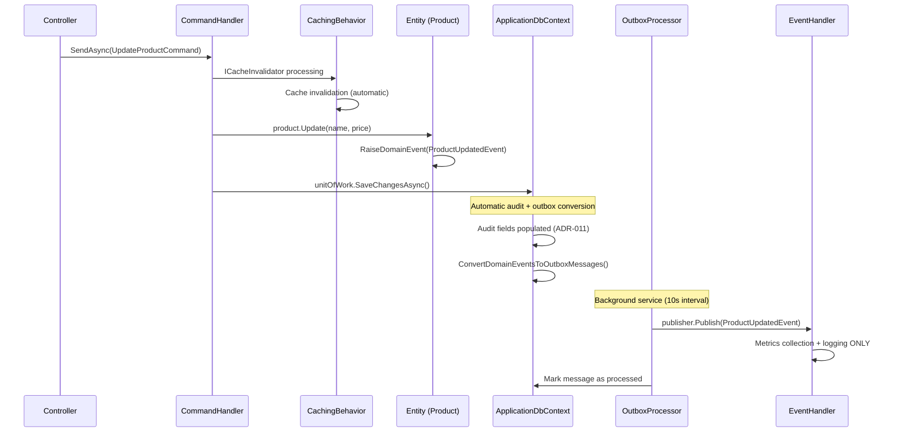

# Domain Events Architecture - Updated Documentation

## 📋 Overview

The Domain Events system implements the **Outbox Pattern** to ensure **eventual consistency** between domain operations and side effects. **After ADR-016 pipeline optimization**, handlers focus solely on unique responsibilities while avoiding duplication.

## 🔄 Simplified Pipeline Flow (Post ADR-016)



## 🧩 System Components (Updated)

### 1. **Cache Invalidation Pipeline**
**ADR-016 Decision**: Single responsibility via `CachingBehavior`

```csharp
// Commands implement ICacheInvalidator
public sealed record UpdateProductCommand : ICacheInvalidator
{
    public IEnumerable<string> CacheKeysToInvalidate => [$"product:{Id}"];
}

// Cache invalidation happens automatically in CachingBehavior
// Event handlers NO LONGER duplicate this logic
```

### 2. **Audit Trail Pipeline**
**ADR-011 Decision**: Automatic via `ApplicationDbContext.SaveChangesAsync()`

```csharp
public override async Task<int> SaveChangesAsync(CancellationToken cancellationToken = default)
{
    SetAuditFields(); // ⚡ AUTOMATIC AUDIT (CreatedBy, UpdatedBy, etc.)
    ConvertDomainEventsToOutboxMessages();
    return await base.SaveChangesAsync(cancellationToken);
}

// Event handlers NO LONGER duplicate audit logging
```

### 3. **Simplified Event Handlers** (Post ADR-016)
**Current Focus**: Metrics collection + operational logging only

```csharp
internal sealed class ProductUpdatedEventHandler(
    ILogger<ProductUpdatedEventHandler> logger)
    : INotificationHandler<ProductUpdatedEvent>
{
    private static readonly Counter<int> ProductsUpdatedCounter =
        Meter.CreateCounter<int>("products.updated.count");

    public Task Handle(ProductUpdatedEvent notification, CancellationToken cancellationToken)
    {
        logger.LogInformation("Product updated: {ProductId} - {ProductName}",
            notification.ProductId, notification.ProductName);

        // Metrics collection (unique responsibility)
        RecordMetrics(notification);

        return Task.CompletedTask;
    }
}
```

## ✅ What's Correct Now (Post ADR-016)

1. **Single Responsibility**: Each component handles exactly one concern
2. **No Duplication**: Cache invalidation happens once via `CachingBehavior`
3. **No Duplication**: Audit trails happen once via `ApplicationDbContext`
4. **Clean Pipeline**: Event handlers focus on unique side effects only
5. **Consistent**: Following established ADR patterns

## 📊 Before vs After ADR-016

| Component | Before (Redundant) | After (Optimized) |
|---|---|---|
| **Cache Invalidation** | Commands + Event Handlers | Commands only (via ICacheInvalidator) |
| **Audit Logging** | ApplicationDbContext + Event Handlers | ApplicationDbContext only (automatic) |
| **Event Handlers** | Multiple responsibilities | Single responsibility (metrics) |
| **Documentation** | Scattered, contradictory | Centralized in ADR-016 |

## 🎯 Current Event Handler Responsibilities

| Handler | Unique Responsibility |
|---|---|
| `ProductCreatedEventHandler` | Creation metrics + operational logging |
| `ProductUpdatedEventHandler` | Update metrics + operational logging |
| `ProductDeletedEventHandler` | Deletion metrics + operational logging |
| `ProductPatchedEventHandler` | Field-level metrics + operational logging |

## 📚 Related Documentation

- **[ADR-016: Pipeline Redundancy Elimination](../adr/ADR-016-pipeline-redundancy-elimination.md)** - Documents the cleanup decisions
- **[ADR-009: Caching Strategy](../adr/ADR-009-caching.md)** - Explains ICacheInvalidator pattern
- **[ADR-011: Audit Trail](../adr/ADR-011-audit-trail.md)** - Explains automatic audit via ApplicationDbContext
- **[ADR-005: Domain Events & Outbox](../adr/ADR-005-domain-events-outbox.md)** - Core outbox pattern

## ✅ Conclusion

The Domain Events system is **optimized and production-ready** with:

- ✅ **No Redundancy**: Each operation happens exactly once
- ✅ **Clear Separation**: Cache, audit, and metrics have distinct pipelines
- ✅ **Maintainable**: Changes require updates in only one place
- ✅ **Observable**: Metrics provide operational visibility
- ✅ **Documented**: Decisions captured in ADR-016