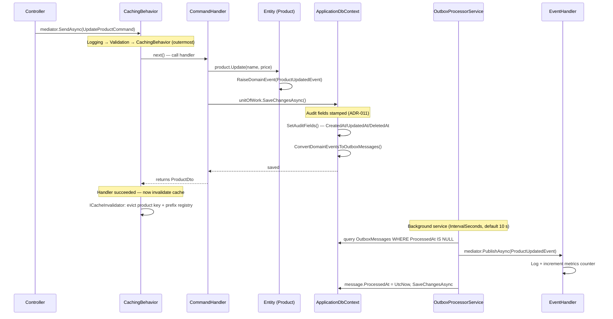

# Domain Events Architecture

## Overview

The Domain Events system implements the **Outbox Pattern** to ensure **eventual consistency** between domain operations and their side effects. Handlers focus solely on unique responsibilities (metrics, operational logging) — caching and audit are handled by dedicated infrastructure components.

## Pipeline Flow



**Key sequencing rule**: cache invalidation fires *after* the handler returns successfully, inside `CachingBehavior`. Domain events are dispatched *asynchronously* by `OutboxProcessorService` — they run up to `OutboxProcessor:IntervalSeconds` seconds later (default 10 s), independently of the HTTP response.

## System Components

### 1. Cache Invalidation — single path via `CachingBehavior`

Commands implement `ICacheInvalidator`. `CachingBehavior` evicts the listed keys *after* the handler completes. Event handlers never touch the cache.

```csharp
public sealed record UpdateProductCommand(Guid Id, ...) : ICommand<ProductDto>, ICacheInvalidator
{
    public IEnumerable<string> CacheKeysToInvalidate =>
        ProductCacheInvalidation.GetIndividualProductKeys(Id);
    public IEnumerable<string> CacheKeyPrefixesToInvalidate =>
        ProductCacheInvalidation.GetProductListPrefixes();
}
```

### 2. Audit Trail — single path via `ApplicationDbContext`

`SetAuditFields()` in `SaveChangesAsync` stamps `CreatedAt/By`, `UpdatedAt/By`, and — for soft-deleted entities — `DeletedAt/By`. Event handlers never write audit fields.

```csharp
// Inside ApplicationDbContext.SetAuditFields()
if (entry.State == EntityState.Added)
{
    entry.Entity.CreatedAt = DateTime.UtcNow;
    entry.Entity.CreatedBy = currentUserService.UserName;
}
else
{
    if (entry.Entity is { IsDeleted: true, DeletedAt: null })
    {
        entry.Entity.DeletedAt = DateTime.UtcNow;
        entry.Entity.DeletedBy = currentUserService.UserName;
    }
    entry.Entity.UpdatedAt = DateTime.UtcNow;
    entry.Entity.UpdatedBy = currentUserService.UserName;
}
```

### 3. Event Handlers — metrics + operational logging only

```csharp
internal sealed class ProductUpdatedEventHandler(
    ILogger<ProductUpdatedEventHandler> logger)
    : IDomainEventHandler<ProductUpdatedEvent>
{
    public Task Handle(ProductUpdatedEvent notification, CancellationToken cancellationToken)
    {
        logger.LogInformation("Product updated: {ProductId} - {ProductName} - Price: {NewPrice}",
            notification.ProductId, notification.ProductName, notification.NewPrice);

        ProductTelemetry.UpdatedCounter.Add(1,
            new KeyValuePair<string, object?>("product_id", notification.ProductId));

        return Task.CompletedTask;
    }
}
```

### 4. Outbox Processor — resilience features

`OutboxProcessorService` polls every `OutboxProcessor:IntervalSeconds` seconds (default 10, configurable via `appsettings.json`) and includes:

- **Polly exponential backoff**: 3 retries (2 s, 4 s, 8 s) per message
- **Dead Letter Queue**: messages exceeding max retries move to `DeadLetterMessages`
- **Idempotency**: SHA-256(type + content) key prevents duplicate dispatch on retry
- **Event versioning**: `EventMigrationHandler` can up-convert old event payloads

## Component Responsibility Matrix

| Concern | Component | Where |
|---|---|---|
| Cache invalidation | `CachingBehavior` + `ICacheInvalidator` | Application pipeline |
| Audit stamping | `ApplicationDbContext.SetAuditFields()` | Infrastructure, on `SaveChanges` |
| Domain event capture | `ApplicationDbContext.ConvertDomainEventsToOutboxMessages()` | Infrastructure, on `SaveChanges` |
| Event dispatch | `OutboxProcessorService` | Infrastructure, background |
| Metrics | `ProductTelemetry` counters in event handlers | Application |
| Operational logging | Event handlers + `LoggingBehavior` | Application |

## Event Catalogue

| Domain Event | Raised by | Fields |
|---|---|---|
| `ProductCreatedEvent` | `Product.Create()` | `ProductId`, `ProductName` |
| `ProductUpdatedEvent` | `Product.Update()` | `ProductId`, `ProductName`, `NewPrice`, `NewDescription` |
| `ProductPatchedEvent` | `Product.Patch()` | `ProductId`, `ProductName`, `ChangedFields` (dict of old→new values) |
| `ProductDeletedEvent` | `DeleteProductCommandHandler` via `product.SoftDelete()` + EF `Modified` state | `ProductId`, `ProductName` |

> **Note**: `Product.Deactivate()` sets `IsActive = false` but does **not** raise a domain event — it is a status toggle, not a lifecycle deletion. The audit trail (`UpdatedAt/By`) records the change automatically.

## Related ADRs

| ADR | Topic |
|---|---|
| [ADR-005](adr/ADR-005-domain-events-outbox.md) | Core outbox pattern |
| [ADR-009](adr/ADR-009-caching.md) | `ICacheInvalidator` interface and prefix registry |
| [ADR-011](adr/ADR-011-audit-trail.md) | Automatic audit via `ApplicationDbContext` |
| [ADR-015](adr/ADR-015-production-ready-enhancements.md) | Polly retry, DLQ, event versioning, idempotency |
| [ADR-016](adr/ADR-016-pipeline-redundancy-elimination.md) | Why handlers do not duplicate cache/audit |
| [ADR-019](adr/ADR-019-soft-delete-concurrency-interaction.md) | Soft delete + concurrency interaction |
